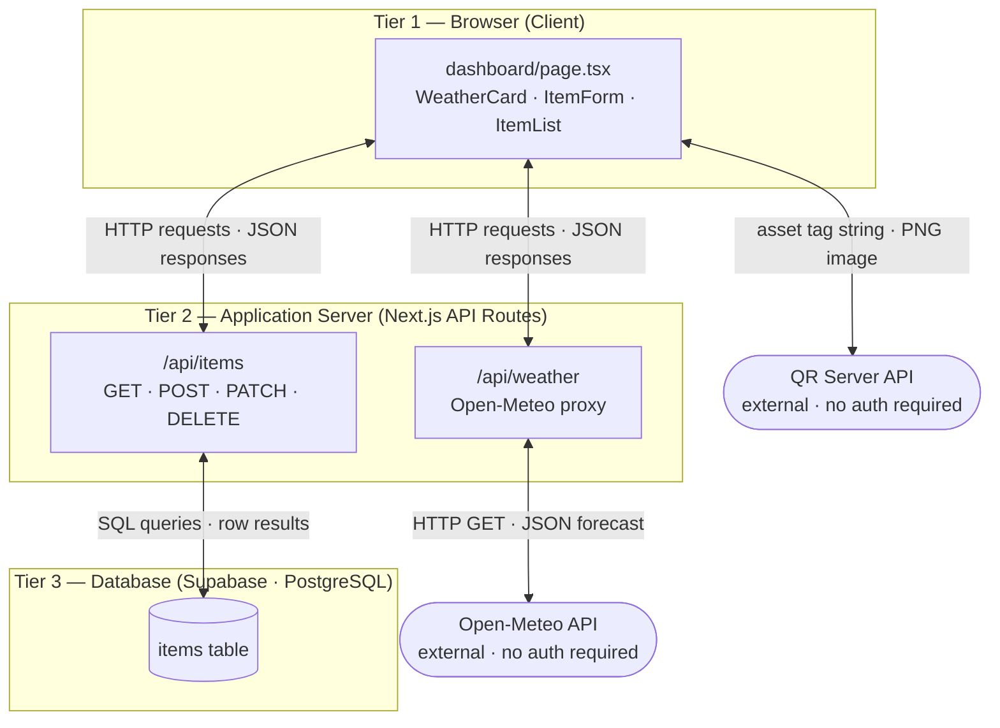

# TECHIN 510 Week 5 Lab Report

---

## Component A: Staff Interview

### Interview Notes

The current return process starts when Maason and Kevin set up a table on the third floor. Student teams arrive one at a time and Maason goes through a return checklist item by item, asking each team whether they have a given item to return. When a team confirms they have something, Maason marks it off the checklist. After all items from a team are verified, Maason and Kevin divide everything into three categories: items that belong to IT inventory, items that belong to the makerspace, and items that should be discarded because they were consumed as part of a prototype or are otherwise not worth keeping.

Any item going into inventory needs a barcode sticker applied. GIX uses pre-generated eight digit barcodes from a roll of stickers issued by the University of Washington. Once a sticker is on the item, Maason or Kevin enters it into BlueTally, the asset tracking software that GIX uses to manage equipment checkouts. BlueTally does support CSV import, but Maason rarely uses it for the return process because item names in the checklist come directly from Amazon product listings and are too long and messy. He wants short clean names like "Hollyland Mars M2 Wireless Mic" rather than a full Amazon description stuffed into a title field. Cleaning up those names one by one is a friction point that makes batch CSV import impractical right now.

On top of the returned purchased items, Maason also needs to check back in any items that were individually borrowed from BlueTally during the year. So on return day a team might have both purchased items to hand back and borrowed items to check in, and Maason handles both at the same table.

I think the core pain is not just that the process is slow, but that it requires too many manual transitions: cross reference the checklist, make a category judgment, find and apply a barcode, then re enter the item into BlueTally. Each of those is a separate step with no system connecting them.

---

### System Map Sketch

### Build Mandate

> "Based on the interview, I will build an equipment return tracker because Maason said going through every item one by one and re-entering it all into BlueTally takes too long, which means the app needs to speed up the check-in step and output data in a format ready for BlueTally import."

---

## Component B: Lab

### Tech Stack Justification

I chose Next.js with Supabase because the return workflow involves more then one staff member (Maason and Kevin or more) working at the same table and both need to read and write item records at the same time, which requires data to persist across sessions and users rather than staying local to one machine.

### Supabase Schema Report 

| Column | Type | Default | Nullable |
|--------|------|---------|----------|
| id | int8 | auto | No |
| created_at | timestamptz | now() | No |
| item_name | text | | No |
| team_name | text | | No |
| category | text | it | No |
| status | text | pending | No |
| asset_tag | text | | Yes |
| description | text | | Yes |

### Responsive Design Summary

I tested the app at iPhone 14 Pro width using Chrome DevTools.

| Element | Works at Phone Width? | What Breaks? |
|---------|----------------------|--------------|
| Page title | Yes | |
| Navigation | Yes | |
| Forms | Yes | |
| Tables | No | Item table overflows horizontally, columns get cut off |
| Buttons | Yes | |
| Text | Yes | |

The most critical issue was the items table overflowing at phone width. I fixed it by wrapping the table in a div with `overflow-x-auto`, which allows horizontal scrolling instead of clipping the content.

### Deployment URL

_To be added after Vercel deployment._

### Security Checklist

- [x] No hardcoded secrets in source files — Supabase URL and anon key are stored in `.env.local` only
- [x] `.env.local` is listed in `.gitignore` — confirmed not tracked by git
- [x] Error handling on every API call and database operation — all fetch calls use try/catch with user-visible error messages; all Supabase queries check for `error` before using `data`

---

## Component C: System Architecture and Design

### Architecture Diagram

### Design Decision Log

| Field | Entry |
|-------|-------|
| Decision | I used a single `status` text column with three values (pending, returned, labeled) to track each item through the return workflow instead of using separate boolean columns or a separate status table. |
| Alternatives considered | Three separate boolean columns (`is_returned`, `is_labeled`, `is_discarded`), or a separate status history table that logs every transition with a timestamp. |
| Why I chose this | The return workflow is strictly linear — an item always goes pending then returned then labeled, never skips a step or goes backward. A single ordered status column matches that reality and keeps queries simple. |
| Trade-off | I gave up a full audit trail. If Maason wants to know when exactly an item was marked returned, there is no timestamp for that transition. A status history table would capture that but adds complexity that is not needed for this use case. |
| When would I choose differently | If the workflow allowed items to go backward (e.g., an item marked returned could be sent back to pending after a dispute), a status history table would be the right choice. |

---

## Component D: Testing and Validation

_To be completed._

---

## Component E: Applied Challenge

_To be completed._

---

## AI Usage Log

_To be completed._

---

## Reflection

_To be completed._
