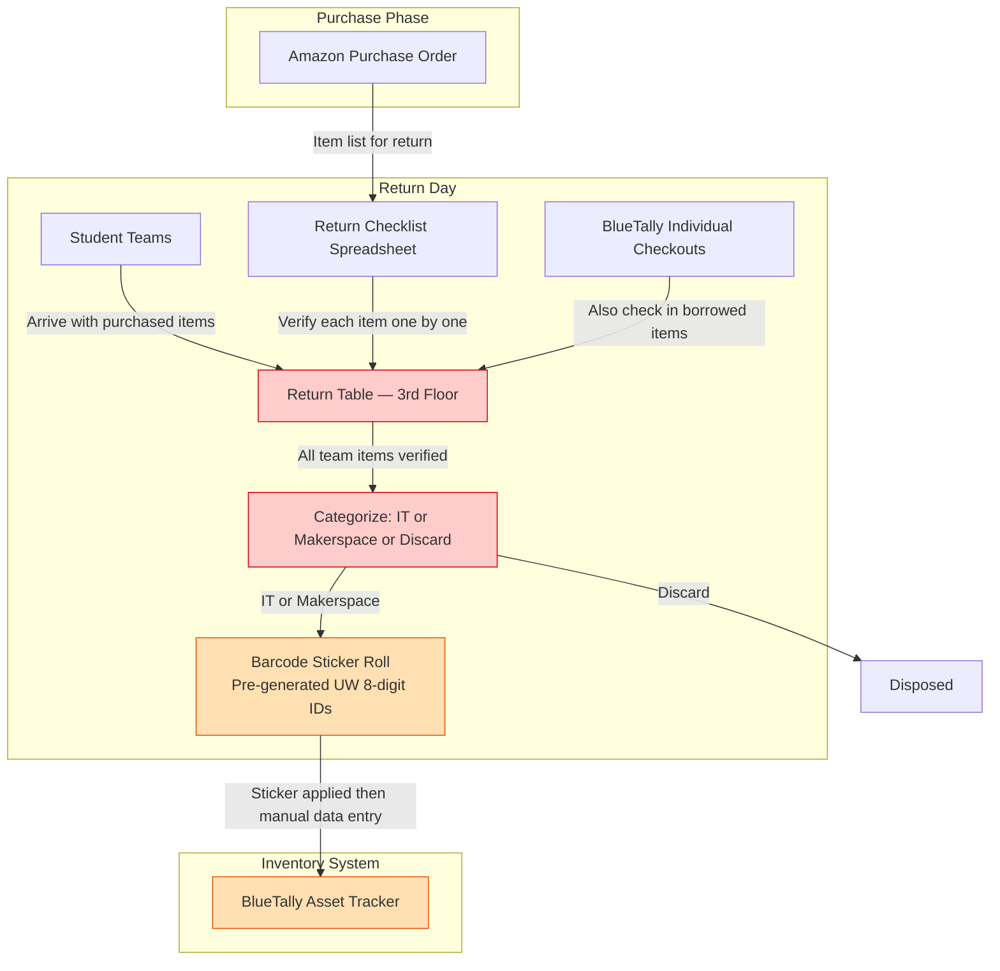

# TECHIN 510 Week 5 Lab Report

---

## Component A: Staff Interview

### Interview Notes

I interviewed Maason Kao, who works in GIX IT alongside his colleague Kevin. The interview focused on the equipment return process that happens at the end of each academic year, after student teams finish their poster sessions and live demonstrations.

The current return process starts when Maason and Kevin set up a table on the third floor. Student teams arrive one at a time and Maason goes through a return checklist item by item, asking each team whether they have a given item to return. When a team confirms they have something, Maason marks it off the checklist. After all items from a team are verified, Maason and Kevin divide everything into three categories: items that belong to IT inventory, items that belong to the makerspace, and items that should be discarded because they were consumed as part of a prototype or are otherwise not worth keeping.

Any item going into inventory needs a barcode sticker applied. GIX uses pre-generated eight digit barcodes from a roll of stickers issued by the University of Washington. Once a sticker is on the item, Maason or Kevin enters it into BlueTally, the asset tracking software that GIX uses to manage equipment checkouts. BlueTally does support CSV import, but Maason rarely uses it for the return process because item names in the checklist come directly from Amazon product listings and are too long and messy. He wants short clean names like "Hollyland Mars M2 Wireless Mic" rather than a full Amazon description stuffed into a title field. Cleaning up those names one by one is a friction point that makes batch CSV import impractical right now.

On top of the returned purchased items, Maason also needs to check back in any items that were individually borrowed from BlueTally during the year. So on return day a team might have both purchased items to hand back and borrowed items to check in, and Maason handles both at the same table.

I think the core pain is not just that the process is slow, but that it requires too many manual transitions: cross reference the checklist, make a category judgment, find and apply a barcode, then re enter the item into BlueTally. Each of those is a separate step with no system connecting them.

---

### System Map

The diagram below shows the tools, data flows, and pain points in the current return workflow. Nodes shaded in red indicate the steps Maason identified as slow or error prone.

Red nodes are pain points. The return table step is slow because each item is verified verbally one by one. The categorization step requires both Maason and Kevin to make a judgment call together, which adds time. The BlueTally entry step is tedious because item names must be cleaned up manually before entry, and barcodes must be assigned on the spot rather than at purchase time.

---

### System Touchpoints

I picked two touchpoints where a staff member directly interacts with the system.

| Touchpoint | Who | What they are doing | Likely device |
|------------|-----|---------------------|---------------|
| Checking items off the return list as teams arrive | Maason (IT operations staff) | Going through the return checklist item by item, asking each team to confirm what they have, and marking items as returned in the spreadsheet | Laptop open on the return table, probably on desktop Chrome |
| Entering newly categorized items into BlueTally | Maason (IT operations staff) | Creating new asset records in BlueTally, assigning a barcode number, setting the item name, and choosing a location (IT shop or makerspace) | Desktop computer at his desk in the IT office |

The first touchpoint signals that the app needs to support a fast check-in flow where Maason can confirm items quickly without switching between screens. The second touchpoint signals that the app should output data in a format that can be imported into BlueTally in one step rather than entered one record at a time.

---

### Build Mandate

Based on the interview, I will build a web app for tracking returned equipment items and their status because the interviewee said the return process requires going through each item one by one from a spreadsheet and then manually re-entering everything into BlueTally, which means the app needs to centralize item check-in, capture the asset tag, and let Maason assign a category so the data can be exported as a clean CSV ready for BlueTally import.

---

## Component B: Lab

_To be completed._

---

## Component C: System Architecture and Design

_To be completed._

---

## Component D: Testing and Validation

_To be completed._

---

## Component E: Applied Challenge

_To be completed._

---

## AI Usage Log

_To be completed._

---

## Reflection

_To be completed._
